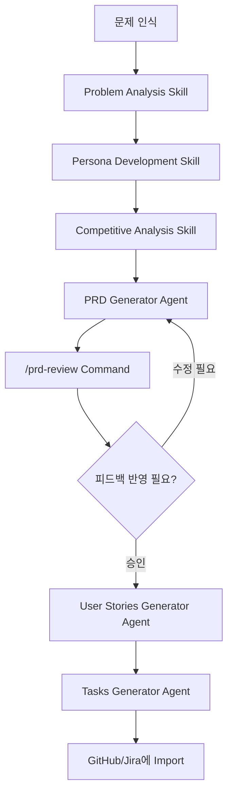

# PRD Agents for Claude Code

> Claude Code를 활용한 제품 기획자(Product Manager)를 위한 AI 에이전트, 커맨드, 스킬 모음

[](https://opensource.org/licenses/MIT)

## 🚀 소개

제품 기획은 복잡하고 시간이 많이 소요되는 작업입니다. PRD 작성, User Story 생성, 경쟁사 분석, 문제 정의 등 각 단계마다 많은 노력이 필요합니다.

**PRD Agents**는 Claude Code와 함께 사용할 수 있는 AI 에이전트 모음으로, 기획자의 일상 업무를 자동화하고 품질을 향상시킵니다.

### ✨ 주요 기능

- 📝 **자동 PRD 생성**: 아이디어를 입력하면 완전한 Product Requirements Document 생성
- 📋 **User Story 변환**: PRD를 실행 가능한 User Story로 자동 변환
- 🔨 **개발 Task 분해**: User Story를 GitHub/Jira Issue로 변환
- 🔍 **PRD 리뷰**: 작성된 PRD의 품질을 자동으로 검토하고 피드백 제공
- 👥 **페르소나 개발**: 타겟 사용자 페르소나 정의 지원
- 📊 **경쟁사 분석**: 체계적인 경쟁사 분석 프레임워크
- 🎯 **문제 분석**: 올바른 문제를 해결하고 있는지 검증

## 🎯 누구를 위한 것인가요?

- 🎨 **Product Manager**: PRD 작성과 제품 전략 수립을 자동화하고 싶은 기획자
- 💼 **Startup Founder**: 빠르게 제품 문서를 작성하고 검증하고 싶은 창업가
- 🚀 **Product Owner**: Agile 팀을 위한 User Story와 Task를 효율적으로 생성하고 싶은 분
- 📚 **PM 지망생**: 업계 표준의 PRD 작성법을 배우고 싶은 학습자

## 🎬 빠른 시작

### 예시 1: 새로운 기능에 대한 PRD 생성

```
당신: "팀 협업 기능에 대한 PRD를 작성하고 싶어. prd-generator 에이전트를 사용해줘."

Claude: PRD Generator 에이전트가 다음을 질문합니다:
- 해결하려는 문제는 무엇인가요?
- 누가 이 문제를 겪고 있나요?
- 비즈니스 기회는 무엇인가요?
...

[여러분의 답변 후]

Claude: 완전한 PRD 문서를 생성합니다 (Overview, Strategy, User Flows, Technical Approach 등)
```

### 예시 2: PRD를 User Story로 변환

```
당신: "이 PRD를 바탕으로 user story를 만들어줘. user-stories-generator 에이전트를 사용해."

Claude: User Stories Generator가 다음을 생성합니다:
- Epic Overview
- 상세한 User Story (Given-When-Then 형식)
- Acceptance Criteria
- Sprint 추천
- Dependency Map
```

### 예시 3: PRD 검토

```
당신: "/prd-review"

Claude: PRD 파일 경로를 요청합니다.

당신: "docs/feature-collaboration.md"

Claude: 상세한 검토 결과를 제공합니다:
- ✅ 강점
- 🔴 중대한 이슈
- 🟡 개선 제안
- 📋 완성도 체크리스트
```

## 📚 상세 가이드

### Agents

#### 1. PRD Generator (`agents/prd-generator.md`)

완전한 Product Requirements Document를 생성합니다.

**입력**: 제품 아이디어, 문제 설명, 비즈니스 맥락
**출력**:

- 📋 Overview (Problem Statement, Goals, Non-Goals)
- 🎯 Strategy & Context (Success Metrics, Strategic Alignment)
- 👥 Users & Personas
- 💡 Solution (User Flows, Key Features)
- 🔧 Technical Approach
- 🚀 Execution Plan
- ⚠️ Risks & Mitigations
- 📊 Launch Plan

#### 2. User Stories Generator (`agents/user-stories-generator.md`)

PRD를 INVEST 원칙을 따르는 User Story로 변환합니다.

**입력**: PRD 또는 기능 스펙
**출력**:

- Epic Overview
- 상세 User Story (As a..., I want..., So that...)
- Given-When-Then Acceptance Criteria
- Technical & UI/UX Notes
- Test Scenarios
- Sprint Recommendations

#### 3. Tasks Generator (`agents/tasks-generator.md`)

User Story를 실행 가능한 개발 Task로 분해합니다.

**입력**: User Story
**출력**:

- Task Summary Table
- 상세 Task 정의 (Backend, Frontend, Testing 등)
- API Contract & Database Schema
- GitHub/Jira Issue 포맷
- Implementation Guide

### Commands

#### /prd-review

작성된 PRD를 검토하고 상세한 피드백을 제공합니다.

**사용법**:

```
/prd-review
```

**제공하는 피드백**:

- 🟢 강점 분석
- 🔴 중대한 이슈 (반드시 해결 필요)
- 🟡 개선 제안
- 📋 완성도 체크리스트
- 💡 권장사항

### Skills

#### 1. Persona Development (`skills/persona.md`)

타겟 사용자 페르소나를 정의합니다.

**생성 내용**:

- 인구통계 & 배경
- 행동적 특성
- 목표 & 동기
- 페인 포인트
- 제품에 대한 니즈

#### 2. Competitive Analysis (`skills/competitive-analysis.md`)

체계적인 경쟁사 분석을 수행합니다.

**분석 영역**:

- 경쟁 환경 정의
- 경쟁사 프로필
- 기능/가격 비교 매트릭스
- 시장 포지셔닝
- 전략적 인사이트

#### 3. Problem Analysis (`skills/problem-analysis.md`)

올바른 문제를 해결하고 있는지 검증합니다.

**프로세스**:

1. 문제 정의 (누가, 무엇, 언제, 영향)
2. 문제 검증 (증거, 중요성, 시장 규모)
3. 근본 원인 분석 (Five Whys)
4. 현재 솔루션 분석
5. 성공 메트릭 정의

## 🔄 전형적인 워크플로우



### 단계별 설명

1. **문제 분석 단계** (Day 1-2)
    - Problem Analysis Skill로 문제 정의 및 검증
    - Persona Skill로 타겟 사용자 정의
    - Competitive Analysis Skill로 시장 환경 이해

2. **PRD 작성 단계** (Day 3-5)
    - PRD Generator Agent로 완전한 PRD 생성
    - /prd-review Command로 검토 및 개선

3. **실행 계획 단계** (Day 6-7)
    - User Stories Generator Agent로 User Story 생성
    - Tasks Generator Agent로 개발 Task 생성

4. **개발 시작** (Day 8+)
    - GitHub/Jira에 Task Import
    - 개발 팀과 함께 실행

## 🎓 실제 사용 사례

### 사례 1: SaaS 제품의 새 기능 개발

**배경**: B2B SaaS 회사에서 팀 협업 기능 추가

**사용한 도구**:

1. Problem Analysis → 원격 팀의 협업 문제 정의
2. Competitive Analysis → Slack, Teams, Discord 분석
3. PRD Generator → 완전한 PRD 작성 (3일 → 3시간)
4. User Stories Generator → 25개 User Story 생성
5. Tasks Generator → 78개 개발 Task 생성

**결과**: PRD 작성 시간 90% 단축, 팀 정렬 시간 70% 감소

### 사례 2: 스타트업의 MVP 기획

**배경**: 에듀테크 스타트업의 첫 제품 기획

**사용한 도구**:

1. Problem Analysis → 학습자의 핵심 문제 검증
2. Persona Development → 3개 사용자 페르소나 정의
3. PRD Generator → MVP PRD 작성
4. /prd-review → 투자자 미팅 전 검토

**결과**: 2주 만에 투자자 발표 준비 완료, 시드 투자 유치 성공

## 🛠️ 커스터마이징

### 자신만의 Agent 추가

```markdown
# agents/my-custom-agent.md

당신은 [목적]을 수행하는 자율 에이전트입니다.

## 당신의 임무

[에이전트가 수행할 작업 정의]

## 프로세스

### Step 1: [단계명]

[상세 설명]

...
```

### Command 추가

```markdown
# commands/my-command.md

---

## description: 간단한 설명

# My Command

[커맨드 동작 정의]
```

### Skill 추가

```markdown
# skills/my-skill.md

# [스킬 이름]

당신은 [도메인]의 전문가입니다.

## 목적

[스킬의 목적]

## 프로세스

[가이드 프로세스]
```

## 🤝 기여하기

PRD Agents는 오픈소스 프로젝트입니다. 기여를 환영합니다!

### 기여 방법

1. 이 리포지토리를 Fork
2. Feature 브랜치 생성 (`git checkout -b feature/amazing-agent`)
3. 변경사항 Commit (`git commit -m 'Add amazing agent'`)
4. 브랜치에 Push (`git push origin feature/amazing-agent`)
5. Pull Request 생성

### 기여 아이디어

- 🆕 새로운 Agent 추가 (예: Roadmap Generator, Metrics Dashboard)
- 📝 기존 Agent 개선 (더 나은 프롬프트, 구조 개선)
- 🌍 다국어 지원 (영어, 일본어 등)
- 📚 더 많은 예시와 튜토리얼
- 🐛 버그 수정 및 문서 개선

## 📖 관련 자료

### Claude Code

- [공식 문서](https://docs.claude.com/en/docs/claude-code)
- [GitHub](https://github.com/anthropics/claude-code)

### Product Management

- [INVEST 원칙](<https://en.wikipedia.org/wiki/INVEST_(mnemonic)>)
- [Product Management Best Practices](https://www.productplan.com/learn/product-management-best-practices/)
- [Writing Great PRDs](https://www.productplan.com/learn/how-to-write-product-requirements-document/)

### Agile & User Stories

- [User Story Mapping](https://www.jpattonassociates.com/user-story-mapping/)
- [Agile Estimation](https://www.atlassian.com/agile/project-management/estimation)

## 📄 라이선스

이 프로젝트는 [MIT 라이선스](LICENSE)로 배포됩니다.

```
MIT License

Copyright (c) 2025 PRD Agents Contributors

Permission is hereby granted, free of charge, to any person obtaining a copy
of this software and associated documentation files (the "Software"), to deal
in the Software without restriction...
```
